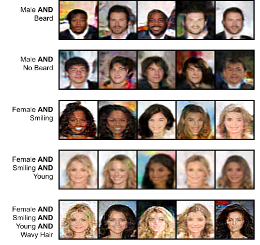

# Gibbs-JEM

Code for the paper:

> Jacob Kelly, Richard Zemel, Will Grathwohl. "Directly Training Joint Energy-Based Models for Conditional Synthesis and Calibrated Prediction of Multi-Attribute Data." _ICML UDL_ (2021).
> [[arxiv]](#) [[bibtex]](#bibtex)

<p align="center">

</p>

# Environment

Create a conda environment with

```
conda env create -f environment.yml
```

# Data

## UTZappos

Create the directory for the dataset

```
mkdir -p data/utzappos
```

Download the [UTZappos dataset](http://vision.cs.utexas.edu/projects/finegrained/utzap50k/) at this [link](http://vision.cs.utexas.edu/projects/finegrained/utzap50k/ut-zap50k-images-square.zip). 
Unzip and place in `data/utzappos`. The path should be `data/utzappos/ut-zap50k-images-square`.

Download the metadata from [here](http://vision.cs.utexas.edu/projects/finegrained/utzap50k/ut-zap50k-data.zip). 
Unzip, and place the file `meta-data.csv` at the path `data/utzappos/ut-zap50k-images-square/meta-data.csv`.

## CelebA

Create the directory for the dataset

```
mkdir -p data/celeba
```

Download the [CelebA dataset](https://mmlab.ie.cuhk.edu.hk/projects/CelebA.html) at this [link](https://drive.google.com/file/d/0B7EVK8r0v71pZjFTYXZWM3FlRnM/view?usp=sharing&resourcekey=0-dYn9z10tMJOBAkviAcfdyQ). Unzip and place in `data/celeba`. The path should be `data/celeba/img_align_celeba`.

Download the metadata [here](https://drive.google.com/file/d/0B7EVK8r0v71pblRyaVFSWGxPY0U/view?usp=sharing&resourcekey=0-YW2qIuRcWHy_1C2VaRGL3Q). 
Place `list_attr_celeba.txt` in `data/celeba/list_attr_celeba.txt`.

# Usage

To train a Gibbs-JEM model on UTZappos, run

```
python train_joint.py --data utzappos --utzappos_drop_infreq 10 --full_test --img_size 64 --img_sigma .01 --mode cond --model poj --poj_joint --small_mlp --small_mlp_nhidden 128 --n_f 64 --multi_gpu --print_every 1 --plot_every 1 --ckpt_every 200 --return_steps 1 --plot_uncond_fresh --plot_cond_buffer --batch_size 100 --n_iters 1000000 --warmup_itrs 0 --lr 1e-4 --truncated_bp --bp 1 --ema .999 --sampling pcd --test_k 60 --test_n_steps 60 --yd_buffer reservoir --interleave --transform --utzappos_blur_transform --transform_every 60 --gibbs_k_steps 1 --test_gibbs_steps 60 --test_gibbs_k_steps 1 --test_gibbs_n_steps 1 --clamp_samples --clamp_data --clip_grad_norm .5 --k 40 --n_steps 1 --sigma .001 --step_size 1 --gibbs_steps 40 --p_y_x 0 --first_gibbs dis --temp 2 --kl .3
```

# BibTeX

```
@article{kelly2021gibbsjem,
  title={Directly Training Joint Energy-Based Models for Conditional Synthesis and Calibrated Prediction of Multi-Attribute Data},
  author={Kelly, Jacob and Zemel, Richard and Grathwohl, Will},
  journal={arXiv preprint arXiv:2107.#},
  year={2021}
}
```
